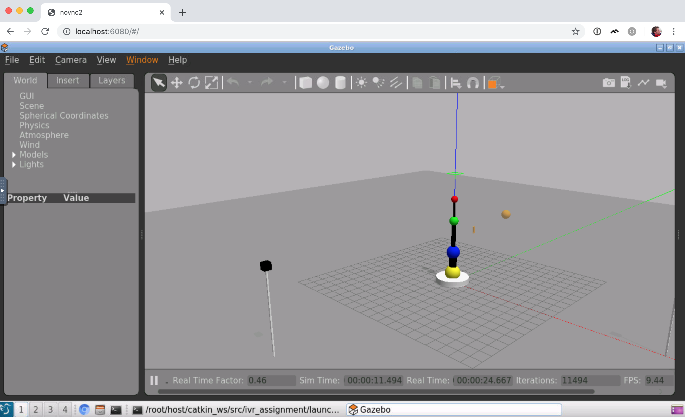

# ubuntu-ros-opencv

Docker image with ROS and OpenCV, accessible via a web browser. Not very tested, runs as root: probably insecure.


## Running

This maps the current directory to /root/host in the docker container.

```bash
docker run --rm -p 6080:80 -v /dev/shm:/dev/shm -v "$PWD":/root/host --name ubuntu-ros-opencv mcharemza/ubuntu-ros-opencv
```

Then go to http://localhost:6080/ to load up the desktop running in the docker container.


